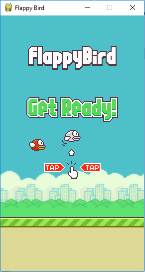
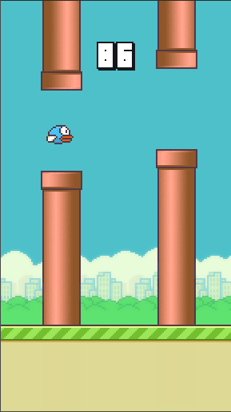

# FlappyBird v1.0

A Flappy Bird Game. Made using Python [pygame](pygame.org) Module.

## Screenshots:



## Setup & Play:

1. Install Python v3 or [Download Manually](https://www.python.org/download/releases) and setup.

2. Install pipenv Python3 module.
	`pip3 install pipenv`  ***If pip3 runs with `pip3` command!***
	`pip install pipenv`   ***If pip3 runs with `pip` command!***

3. Install PyGame Python3 module.
	`pip3 install pygame`  ***If pip3 runs with `pip3` command!***
	`pip install pygame`   ***If pip3 runs with `pip` command!***

4. Clone the repository:

   ```bash
   git clone https://github.com/sourabhv/FlapPyBird
   ```

   Or download as zip and extract. Can download from [Releases](https://github.com/AbirHasan2005/FlappyBird/releases). Also EXE file available.

5. In the root directory run

   ```bash
   pipenv install
   pipenv run python flappy.py
   ```
   Or,
   `python3 flappy.py`  ***If python3 runs with `python3` command!***
   `python flappy.py`   ***If python3 runs with `python` command!***

6. Use <kbd>&uarr;</kbd> or <kbd>Space</kbd> key to play and <kbd>Esc</kbd> to close the game.

***For x64-bit windows, you can play this game without installing anything(like: python3, pip, git, modules). Just download & run the exe file. Get EXE file in [releases](https://github.com/AbirHasan2005/FlappyBird/releases).***

### For any kind of help [Join](http://t.me/linux_repo) my [Telegram Group](http://t.me/linux_repo).
<a href="https://t.me/linux_repo"></a>

### Thanks to [sourabhv](https://github.com/sourabhv).

---

## FOLLOW ME ON:
<a href="https://github.com/AbirHasan2005"></a>

<a href="https://twitter.com/AbirHasan2005"></a>

<a href="https://facebook.com/AbirHasan2005"></a>

<a href="https://instagram.com/AbirHasan2005"></a>

## DONATE:
[](https://paypal.me/AbirHasan2005)
